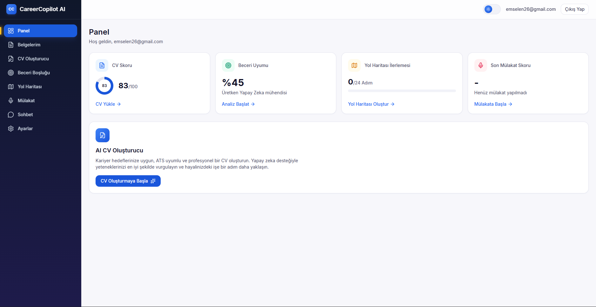
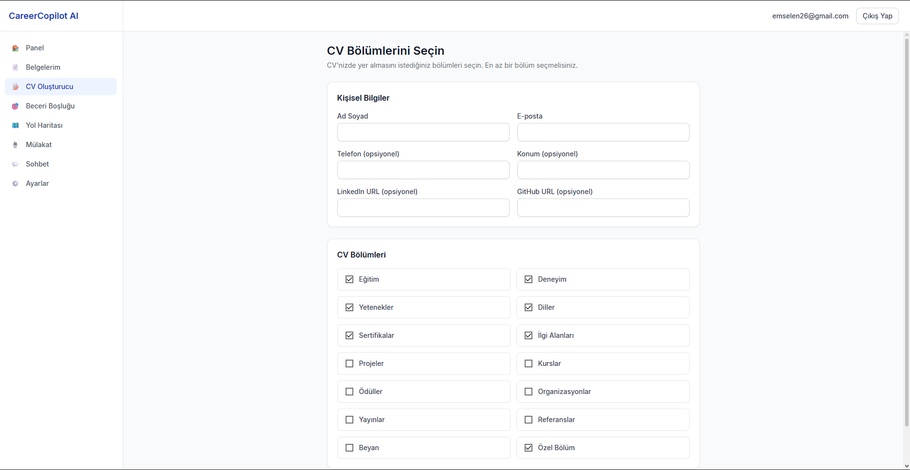
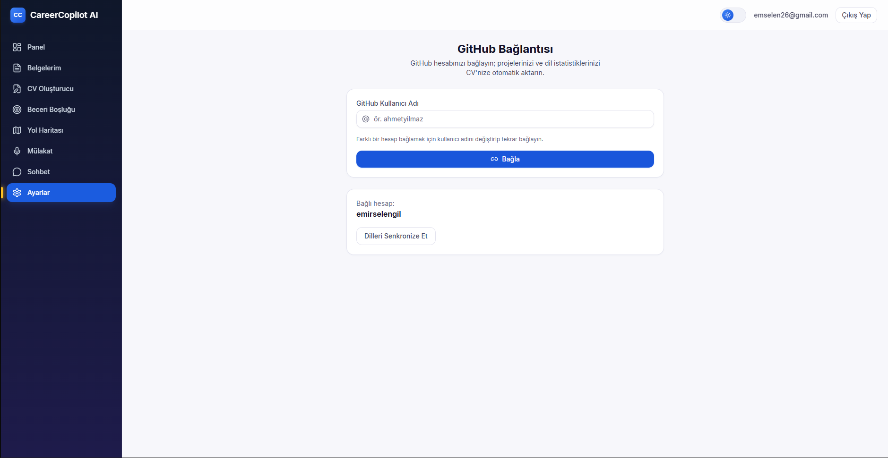
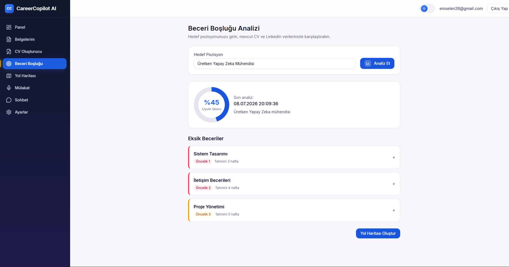
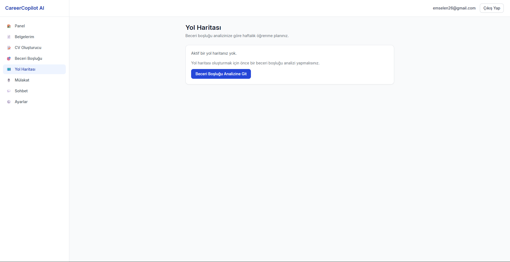
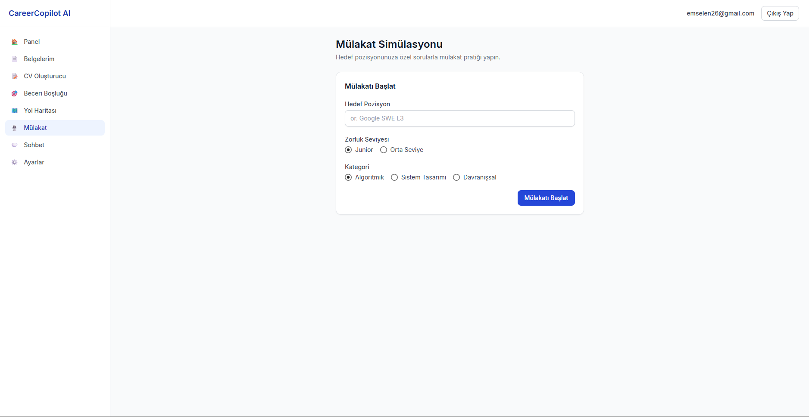
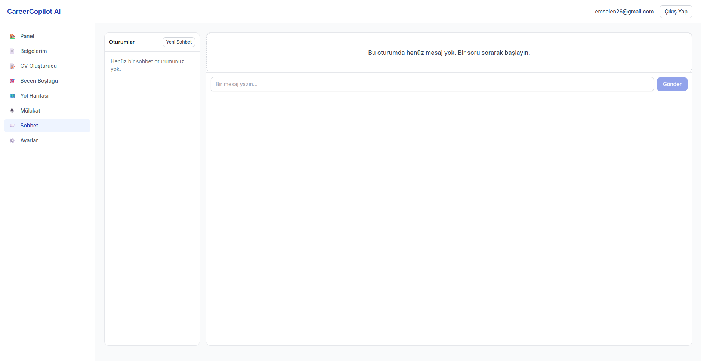

# Takım İsmi

**Takım 82**

---

# Ürün ile İlgili Bilgiler

## Takım Elemanları ve Rolleri

| İsim | Rol |
|---|---|
| Ömer Faruk Yelman | Product Owner |
| Hatice Rana Yamaç | Scrum Master |
| Emir Selengil | Team Member / Developer |
| Beyza Nur Çelik | Team Member / Developer |
| Büşra Arslan | Team Member / Developer |

## Ürün İsmi

**CareerAI**

## Ürün Açıklaması

CareerAI, öğrencilerin ve yeni mezunların kariyer hedeflerine ulaşmalarını kolaylaştırmak amacıyla geliştirilen yapay zekâ destekli bir kariyer danışmanlığı platformudur.

Kullanıcılar CV'lerini sisteme yükleyebilir, GitHub ve LinkedIn hesaplarını bağlayabilir. Yapay zekâ bu verileri analiz ederek kullanıcının mevcut yetkinliklerini değerlendirir, eksik becerilerini belirler ve hedeflediği pozisyona ulaşması için kişiselleştirilmiş bir kariyer gelişim planı sunar.

Sistem yalnızca eksik yönleri göstermekle kalmaz; aynı zamanda haftalık çalışma planı oluşturur, teknik mülakat simülasyonları gerçekleştirir ve kullanıcıya hedeflediği kariyer yolunda takip edebileceği bir roadmap önerir. Çoklu AI Agent mimarisi sayesinde CV analizi, skill gap analizi, roadmap oluşturma ve mülakat simülasyonu gibi süreçler ayrı uzman ajanlar tarafından yürütülerek daha kapsamlı ve kişiselleştirilmiş sonuçlar elde edilmesi hedeflenmektedir.

## Ürün Özellikleri

- CV yükleme ve otomatik analiz
- CV bilgilerini düzenleme
- GitHub hesabı entegrasyonu
- LinkedIn profil entegrasyonu
- Yapay zekâ ile beceri eksikliği analizi
- Kişiselleştirilmiş kariyer yol haritası oluşturma
- Haftalık çalışma planı hazırlama
- AI destekli teknik mülakat simülasyonu
- AI sohbet asistanı ile kariyer danışmanlığı
- Dashboard üzerinden kariyer gelişiminin takip edilmesi
- Çoklu AI Agent mimarisi
  - CV Agent
  - Skill Gap Agent
  - Roadmap Agent
  - Interview Agent
- Kullanıcının hedeflediği şirkete veya pozisyona göre öneriler sunma
- İlerleme ve gelişim takibi

## Hedef Kitle

- Üniversite öğrencileri
- Yeni mezun yazılım geliştiriciler
- Staj arayan öğrenciler
- Junior seviyedeki yazılım mühendisleri
- Kariyer değişikliği yapmak isteyen bireyler
- Teknik mülakatlara hazırlanan adaylar
- Yazılım alanında kendini geliştirmek isteyen kişiler

---

# Product Backlog

Product backlog, CareerAI platformunun temel kullanıcı akışını ve yapay zekâ destekli analiz süreçlerini kapsayacak şekilde hazırlanmıştır.

Backlog oluşturulurken önceliklendirme şu kriterlere göre yapılmıştır:

- Kullanıcının ürünü ilk kez deneyimleyebilmesi için gerekli temel ekranlar
- CV yükleme ve analiz akışının oluşturulması
- Kullanıcının mevcut yetkinliklerini ve eksik becerilerini görebilmesi
- Kariyer yol haritası ve mülakat simülasyonu gibi ürünün ana değer önerisini gösteren özellikler
- Backend ve gerçek AI entegrasyonlarına temel oluşturacak frontend yapısının hazırlanması

## Product Backlog URL

[Miro Product Backlog Board](https://miro.com/app/board/uXjVHHXhof0=/)

---

# Sprint 1

## Sprint Notları

Sprint 1 kapsamında CareerAI projesinin temel kullanıcı arayüzünün oluşturulması ve kullanıcının platformdaki ana akışları deneyimleyebilmesi hedeflenmiştir. Bu sprintte öncelik, backend ve gerçek yapay zekâ entegrasyonlarından önce ürünün temel frontend iskeletini ve kullanıcı deneyimini ortaya çıkarmak olmuştur.

## Sprint İçinde Tamamlanması Hedeflenen Puan

**Sprint hedef puanı:** 100 puan

Sprint 1 için seçilen işler, ürünün ilk kullanılabilir prototipini ortaya çıkaracak şekilde belirlenmiştir. Story point dağılımı, işlerin kapsamı ve geliştirme zorluğu dikkate alınarak yapılmıştır.

| Backlog Item | Açıklama | Story Point | Durum |
|---|---|---:|---|
| Kullanıcı kayıt ve giriş ekranları | Kullanıcının sisteme kayıt olup giriş yapabilmesi | 10 | Tamamlandı |
| Dashboard ekranı | Kullanıcının kariyer gelişimini genel olarak takip edebilmesi | 15 | Tamamlandı |
| CV yükleme ekranı | Kullanıcının CV dosyasını sisteme yükleyebilmesi | 10 | Tamamlandı |
| CV düzenleme ekranı | Kullanıcının CV bilgilerinde düzenleme yapabilmesi | 10 | Tamamlandı |
| GitHub entegrasyon ekranı | Kullanıcının GitHub hesabını bağlayabileceği arayüzün hazırlanması | 10 | Tamamlandı |
| Skill Gap Analysis ekranı | Kullanıcının eksik becerilerini görüntüleyebileceği analiz ekranı | 15 | Tamamlandı |
| Career Roadmap ekranı | Kullanıcıya kariyer yol haritası sunan ekranın hazırlanması | 15 | Tamamlandı |
| Interview Simulation ekranı | Teknik mülakat simülasyonu için temel ekranın hazırlanması | 10 | Tamamlandı |
| AI Chat ekranı | Kariyer danışmanlığı için AI sohbet ekranının hazırlanması | 5 | Tamamlandı |

**Tamamlanan puan:** 100 / 100

> Not: Backend servisleri, gerçek AI Agent entegrasyonları, LinkedIn API bağlantısı ve gerçek zamanlı veri işleme süreçleri sonraki sprintlere bırakılmıştır.

## Backlog Düzeni ve Story Seçimleri

Product backlog, ürünün temel değer önerisini en kısa sürede görünür hâle getirecek şekilde düzenlenmiştir. İlk sprintte özellikle kullanıcının sisteme giriş yapması, CV yüklemesi, beceri analizini görüntülemesi, kariyer yol haritasını incelemesi ve mülakat simülasyonu başlatabilmesi gibi temel kullanıcı senaryoları seçilmiştir.

Sprint 1 için seçilen story'ler aşağıdaki gerekçelere göre belirlenmiştir:

- Ürünün temel kullanıcı yolculuğunu gösterecek ekranların öncelikli olması
- Akademi değerlendirmesinde ürün fikrinin somut olarak anlaşılmasını sağlayacak arayüzlerin hazırlanması
- Sonraki sprintlerde backend ve AI servislerinin bağlanabileceği modüler bir frontend yapısının oluşturulması
- Kullanıcı deneyiminin erken aşamada test edilebilir hâle getirilmesi
- CV, skill gap, roadmap ve interview gibi ürünün ana modüllerinin ilk prototiplerinin çıkarılması

Sprint board üzerinde işler genel olarak aşağıdaki akışa göre takip edilmiştir:

- **Backlog:** Henüz sprint içine alınmamış veya detaylandırılması gereken işler
- **To Do:** Sprint 1 kapsamında yapılması planlanan işler
- **In Progress:** Geliştirme süreci devam eden işler
- **Review / Test:** Kontrol ve düzenleme aşamasındaki işler
- **Done:** Tamamlanan işler

## Daily Scrum

Daily Scrum toplantıları takım üyelerinin ilerleme durumunu paylaşması, karşılaşılan problemleri belirtmesi ve bir sonraki adımların belirlenmesi amacıyla gerçekleştirilmiştir.

Toplantılarda genel olarak şu sorular üzerinden ilerlenmiştir:

- Dün ne yaptım?
- Bugün ne yapacağım?
- Önümde bir engel var mı?
- Sprint hedefini etkileyen bir gecikme veya risk var mı?

Daily Scrum toplantı çıktıları PDF olarak README içerisinde paylaşılmıştır:

[Grup82-Sprint1-DailyScrums.pdf](https://github.com/user-attachments/files/29664169/Grup82-Sprint1-DailyScrums.pdf)

## Sprint Board Screenshots

Sprint board ekran görüntüleri aşağıdaki alana eklenmelidir.

> Görselleri repo içinde `docs/sprint1/` klasörüne ekledikten sonra aşağıdaki dosya adlarını aynı şekilde kullanabilirsiniz.

### Sprint Board - Başlangıç


### Sprint Board - Geliştirme Süreci


### Sprint Board - Sprint Sonu


## Ürün Durumu: Ekran Görüntüleri

Sprint 1 sonunda CareerAI projesinin temel frontend ekranları hazırlanmıştır. Ürün ekran görüntüleri aşağıdaki bölümlerde paylaşılmalıdır.

> Görselleri repo içinde `docs/sprint1/product-screens/` klasörüne ekledikten sonra aşağıdaki dosya adlarını aynı şekilde kullanabilirsiniz.

### Login / Register Ekranı


### Dashboard Ekranı



### CV Yükleme Ekranı


### CV Düzenleme Ekranı



### GitHub Entegrasyon Ekranı



### Skill Gap Analysis Ekranı



### Career Roadmap Ekranı



### Interview Simulation Ekranı



### AI Chat Ekranı



## Sprint Review

Sprint 1 sonunda CareerAI projesinin temel kullanıcı arayüzü büyük ölçüde tamamlanmıştır. Kullanıcının kariyer gelişim sürecini tek platform üzerinden yönetebilmesi amacıyla Dashboard, CV yükleme, CV düzenleme, GitHub entegrasyonu, beceri boşluğu analizi, kariyer yol haritası, mülakat simülasyonu ve AI sohbet ekranları tasarlanmıştır.

Sprint sonunda kullanıcı aşağıdaki işlemleri yapabilecek temel arayüzlere sahip olmuştur:

- Sisteme kayıt olabilmekte ve giriş yapabilmektedir.
- CV dosyasını sisteme yükleyebilmektedir.
- CV bilgilerinde düzenleme yapabilmektedir.
- GitHub hesabını sisteme bağlayabileceği arayüzü görüntüleyebilmektedir.
- Beceri boşluğu analizini görüntüleyebilmektedir.
- AI tarafından oluşturulacak kariyer yol haritası için hazırlanan ekranı inceleyebilmektedir.
- AI destekli mülakat simülasyonu için hazırlanan ekranı kullanabilmektedir.
- AI Chat ekranı üzerinden kariyer danışmanlığı alabileceği arayüze erişebilmektedir.

Bu sprintte ürünün frontend tarafındaki temel kullanıcı deneyimi oluşturulmuştur. Backend servisleri, gerçek AI Agent yapısı, LinkedIn entegrasyonu ve gerçek zamanlı analizlerin entegrasyonu sonraki sprintlere bırakılmıştır.

## Sprint Retrospective

### Neler İyi Gitti?

- Uygulamanın temel sayfaları planlanan süre içerisinde tamamlandı.
- Tüm ekranlarda ortak ve tutarlı bir kullanıcı arayüzü oluşturuldu.
- Kullanıcı akışı Login / Register → Dashboard → CV Analysis → Skill Gap → Roadmap → Interview → AI Chat şeklinde başarıyla tasarlandı.
- Modüler sayfa yapısı sayesinde ileride backend entegrasyonunun daha kolay yapılabileceği bir temel oluşturuldu.
- Takım içi görev paylaşımı sprint sürecinin daha düzenli ilerlemesine katkı sağladı.

### Karşılaşılan Zorluklar

- AI servisleri henüz backend ile entegre edilmediği için bazı ekranlarda örnek/mock veriler kullanıldı.
- Sayfalar arası veri aktarımı ve kullanıcı akışının düzenlenmesi planlanandan daha fazla zaman aldı.
- CV ve GitHub entegrasyonlarının gerçek API bağlantıları sonraki sprintlere bırakıldı.
- LinkedIn entegrasyonu için API erişimi ve veri çekme süreci ayrıca araştırılması gereken bir konu olarak belirlendi.

### Gelecek Sprintte Yapılacaklar

- Backend API entegrasyonlarının tamamlanması
- Çoklu AI Agent mimarisinin geliştirilmesi
  - CV Agent
  - Skill Gap Agent
  - Roadmap Agent
  - Interview Agent
- LinkedIn entegrasyonunun eklenmesi
- GitHub üzerinden gerçek veri çekme sürecinin geliştirilmesi
- AI analizlerinin gerçek LLM servisleriyle çalıştırılması
- CV dosyası üzerinden veri çıkarma ve analiz sürecinin geliştirilmesi
- Son kullanıcı testleri ve performans optimizasyonlarının yapılması

## Sprint 1 Genel Değerlendirme

Sprint 1 sonunda CareerAI projesinin kullanıcı arayüzü büyük ölçüde tamamlanmış ve ürünün temel kullanıcı deneyimi ortaya çıkarılmıştır. Bir sonraki sprintte sistemin yapay zekâ destekli karar mekanizmaları, backend bağlantıları ve veri işleme süreçlerinin geliştirilmesine odaklanılacaktır.

---

# Kullanılan Teknolojiler

> Bu bölümü projenizde gerçekten kullanılan teknolojilere göre güncelleyiniz.

- Frontend: React / Next.js / HTML / CSS / JavaScript
- Backend: Planlanıyor
- AI Servisleri: Planlanıyor
- Tasarım ve Backlog: Miro
- Versiyon Kontrol: Git & GitHub

---

# Kurulum ve Çalıştırma

> Proje dosyaları repoya eklendikten sonra bu bölüm güncellenmelidir.

```bash
git clone https://github.com/Rana-yamach/CareerCopilot-AI.git
cd CareerCopilot-AI
npm install
npm run dev
```

---

# Lisans

Bu proje MIT lisansı ile lisanslanmıştır.
