# Takım İsmi

**Takım 82**

---

# Ürün ile İlgili Bilgiler

## Takım Elemanları ve Rolleri

| İsim | Rol |
|---|---|
| Ömer Faruk Yelman | Product Owner |
| Hatice Rana Yamaç | Scrum Master |
| Emir Selengil | Team Member / Developer |
| Beyza Nur Çelik | Team Member / Developer |
| Büşra Arslan | Team Member / Developer |

## Ürün İsmi

**CareerAI**

## Ürün Açıklaması

CareerAI, öğrencilerin ve yeni mezunların kariyer hedeflerine ulaşmalarını kolaylaştırmak amacıyla geliştirilen yapay zekâ destekli bir kariyer danışmanlığı platformudur.

Kullanıcılar CV'lerini sisteme yükleyebilir, GitHub ve LinkedIn hesaplarını bağlayabilir. Yapay zekâ bu verileri analiz ederek kullanıcının mevcut yetkinliklerini değerlendirir, eksik becerilerini belirler ve hedeflediği pozisyona ulaşması için kişiselleştirilmiş bir kariyer gelişim planı sunar.

Sistem yalnızca eksik yönleri göstermekle kalmaz; aynı zamanda haftalık çalışma planı oluşturur, teknik mülakat simülasyonları gerçekleştirir ve kullanıcıya hedeflediği kariyer yolunda takip edebileceği bir roadmap önerir. Çoklu AI Agent mimarisi sayesinde CV analizi, skill gap analizi, roadmap oluşturma ve mülakat simülasyonu gibi süreçler ayrı uzman ajanlar tarafından yürütülerek daha kapsamlı ve kişiselleştirilmiş sonuçlar elde edilmesi hedeflenmektedir.

## Ürün Özellikleri

- CV yükleme ve otomatik analiz
- CV bilgilerini düzenleme
- GitHub hesabı entegrasyonu
- LinkedIn profil entegrasyonu
- Yapay zekâ ile beceri eksikliği analizi
- Kişiselleştirilmiş kariyer yol haritası oluşturma
- Haftalık çalışma planı hazırlama
- AI destekli teknik mülakat simülasyonu
- AI sohbet asistanı ile kariyer danışmanlığı
- Dashboard üzerinden kariyer gelişiminin takip edilmesi
- Çoklu AI Agent mimarisi
  - CV Agent
  - Skill Gap Agent
  - Roadmap Agent
  - Interview Agent
- Kullanıcının hedeflediği şirkete veya pozisyona göre öneriler sunma
- İlerleme ve gelişim takibi

## Hedef Kitle

- Üniversite öğrencileri
- Yeni mezun yazılım geliştiriciler
- Staj arayan öğrenciler
- Junior seviyedeki yazılım mühendisleri
- Kariyer değişikliği yapmak isteyen bireyler
- Teknik mülakatlara hazırlanan adaylar
- Yazılım alanında kendini geliştirmek isteyen kişiler

---

# Product Backlog

Product backlog, CareerAI platformunun temel kullanıcı akışını ve yapay zekâ destekli analiz süreçlerini kapsayacak şekilde hazırlanmıştır.

Backlog oluşturulurken önceliklendirme şu kriterlere göre yapılmıştır:

- Kullanıcının ürünü ilk kez deneyimleyebilmesi için gerekli temel ekranlar
- CV yükleme ve analiz akışının oluşturulması
- Kullanıcının mevcut yetkinliklerini ve eksik becerilerini görebilmesi
- Kariyer yol haritası ve mülakat simülasyonu gibi ürünün ana değer önerisini gösteren özellikler
- Backend ve gerçek AI entegrasyonlarına temel oluşturacak frontend yapısının hazırlanması

## Product Backlog URL

[Miro Product Backlog Board](https://miro.com/app/board/uXjVHHXhof0=/)

---

# Sprint 1

## Sprint Notları

Sprint 1 kapsamında CareerAI projesinin temel kullanıcı arayüzünün oluşturulması ve kullanıcının platformdaki ana akışları deneyimleyebilmesi hedeflenmiştir. Bu sprintte öncelik, backend ve gerçek yapay zekâ entegrasyonlarından önce ürünün temel frontend iskeletini ve kullanıcı deneyimini ortaya çıkarmak olmuştur.

## Sprint İçinde Tamamlanması Hedeflenen Puan

**Sprint hedef puanı:** 100 puan

Sprint 1 için seçilen işler, ürünün ilk kullanılabilir prototipini ortaya çıkaracak şekilde belirlenmiştir. Story point dağılımı, işlerin kapsamı ve geliştirme zorluğu dikkate alınarak yapılmıştır.

| Backlog Item | Açıklama | Story Point | Durum |
|---|---|---:|---|
| Kullanıcı kayıt ve giriş ekranları | Kullanıcının sisteme kayıt olup giriş yapabilmesi | 10 | Tamamlandı |
| Dashboard ekranı | Kullanıcının kariyer gelişimini genel olarak takip edebilmesi | 15 | Tamamlandı |
| CV yükleme ekranı | Kullanıcının CV dosyasını sisteme yükleyebilmesi | 10 | Tamamlandı |
| CV düzenleme ekranı | Kullanıcının CV bilgilerinde düzenleme yapabilmesi | 10 | Tamamlandı |
| GitHub entegrasyon ekranı | Kullanıcının GitHub hesabını bağlayabileceği arayüzün hazırlanması | 10 | Tamamlandı |
| Skill Gap Analysis ekranı | Kullanıcının eksik becerilerini görüntüleyebileceği analiz ekranı | 15 | Tamamlandı |
| Career Roadmap ekranı | Kullanıcıya kariyer yol haritası sunan ekranın hazırlanması | 15 | Tamamlandı |
| Interview Simulation ekranı | Teknik mülakat simülasyonu için temel ekranın hazırlanması | 10 | Tamamlandı |
| AI Chat ekranı | Kariyer danışmanlığı için AI sohbet ekranının hazırlanması | 5 | Tamamlandı |

**Tamamlanan puan:** 100 / 100

> Not: Backend servisleri, gerçek AI Agent entegrasyonları, LinkedIn API bağlantısı ve gerçek zamanlı veri işleme süreçleri sonraki sprintlere bırakılmıştır.

## Backlog Düzeni ve Story Seçimleri

Product backlog, ürünün temel değer önerisini en kısa sürede görünür hâle getirecek şekilde düzenlenmiştir. İlk sprintte özellikle kullanıcının sisteme giriş yapması, CV yüklemesi, beceri analizini görüntülemesi, kariyer yol haritasını incelemesi ve mülakat simülasyonu başlatabilmesi gibi temel kullanıcı senaryoları seçilmiştir.

Sprint 1 için seçilen story'ler aşağıdaki gerekçelere göre belirlenmiştir:

- Ürünün temel kullanıcı yolculuğunu gösterecek ekranların öncelikli olması
- Akademi değerlendirmesinde ürün fikrinin somut olarak anlaşılmasını sağlayacak arayüzlerin hazırlanması
- Sonraki sprintlerde backend ve AI servislerinin bağlanabileceği modüler bir frontend yapısının oluşturulması
- Kullanıcı deneyiminin erken aşamada test edilebilir hâle getirilmesi
- CV, skill gap, roadmap ve interview gibi ürünün ana modüllerinin ilk prototiplerinin çıkarılması

Sprint board üzerinde işler genel olarak aşağıdaki akışa göre takip edilmiştir:

- **Backlog:** Henüz sprint içine alınmamış veya detaylandırılması gereken işler
- **To Do:** Sprint 1 kapsamında yapılması planlanan işler
- **In Progress:** Geliştirme süreci devam eden işler
- **Review / Test:** Kontrol ve düzenleme aşamasındaki işler
- **Done:** Tamamlanan işler

## Daily Scrum

Daily Scrum toplantıları takım üyelerinin ilerleme durumunu paylaşması, karşılaşılan problemleri belirtmesi ve bir sonraki adımların belirlenmesi amacıyla gerçekleştirilmiştir.

Toplantılarda genel olarak şu sorular üzerinden ilerlenmiştir:

- Dün ne yaptım?
- Bugün ne yapacağım?
- Önümde bir engel var mı?
- Sprint hedefini etkileyen bir gecikme veya risk var mı?

Daily Scrum toplantı çıktıları PDF olarak README içerisinde paylaşılmıştır:

[Grup82-Sprint1-DailyScrums.pdf](https://github.com/user-attachments/files/29664169/Grup82-Sprint1-DailyScrums.pdf)

## Sprint Board Screenshots

Sprint board ekran görüntüleri aşağıdaki alana eklenmelidir.

> Görselleri repo içinde `docs/sprint1/` klasörüne ekledikten sonra aşağıdaki dosya adlarını aynı şekilde kullanabilirsiniz.

### Sprint Board - Sprint Sonu

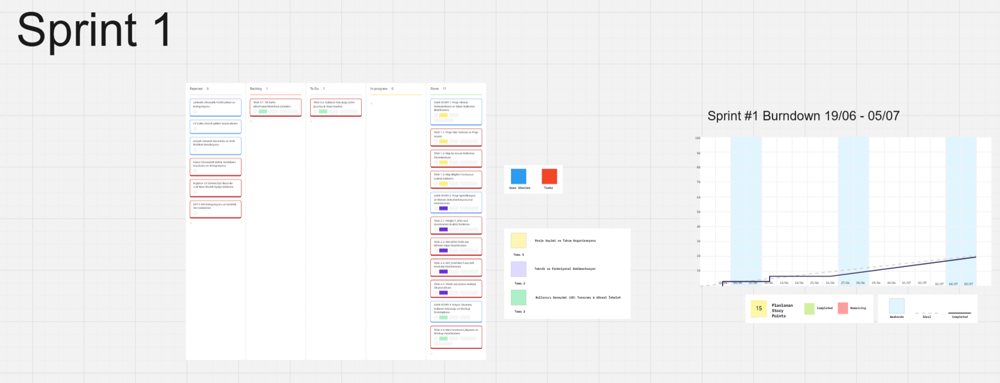

## Ürün Durumu: Ekran Görüntüleri

Sprint 1 sonunda CareerAI projesinin temel frontend ekranları hazırlanmıştır. Ürün ekran görüntüleri aşağıdaki bölümlerde paylaşılmalıdır.

> Görselleri repo içinde `docs/sprint1/product-screens/` klasörüne ekledikten sonra aşağıdaki dosya adlarını aynı şekilde kullanabilirsiniz.

### Login / Register Ekranı

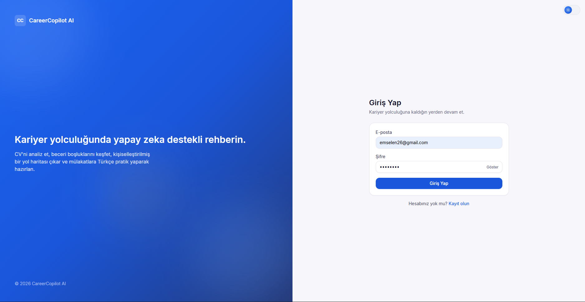
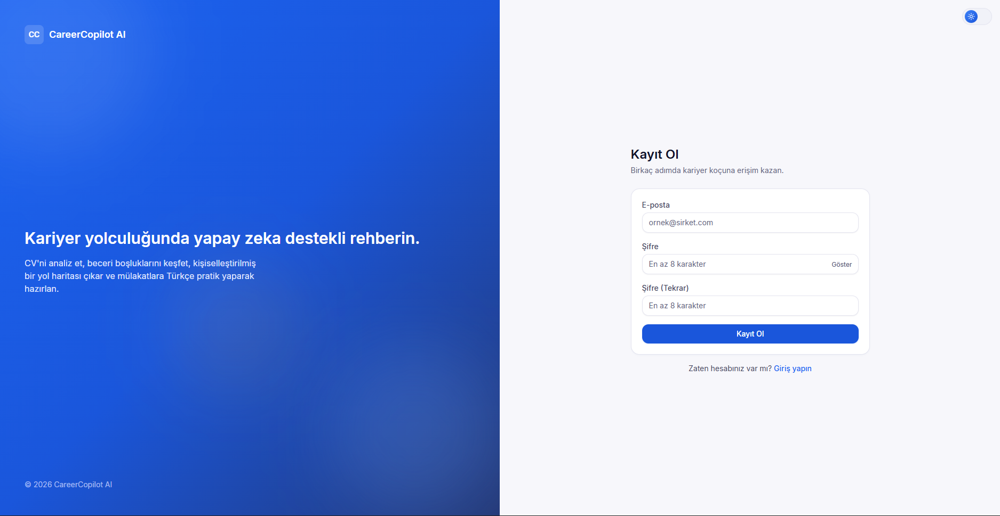

### Dashboard Ekranı


### CV Yükleme Ekranı


### CV Düzenleme Ekranı


### GitHub Entegrasyon Ekranı


### Skill Gap Analysis Ekranı


### Career Roadmap Ekranı


### Interview Simulation Ekranı


### AI Chat Ekranı


## Sprint Review

Sprint 1 sonunda CareerAI projesinin temel kullanıcı arayüzü büyük ölçüde tamamlanmıştır. Kullanıcının kariyer gelişim sürecini tek platform üzerinden yönetebilmesi amacıyla Dashboard, CV yükleme, CV düzenleme, GitHub entegrasyonu, beceri boşluğu analizi, kariyer yol haritası, mülakat simülasyonu ve AI sohbet ekranları tasarlanmıştır.

Sprint sonunda kullanıcı aşağıdaki işlemleri yapabilecek temel arayüzlere sahip olmuştur:

- Sisteme kayıt olabilmekte ve giriş yapabilmektedir.
- CV dosyasını sisteme yükleyebilmektedir.
- CV bilgilerinde düzenleme yapabilmektedir.
- GitHub hesabını sisteme bağlayabileceği arayüzü görüntüleyebilmektedir.
- Beceri boşluğu analizini görüntüleyebilmektedir.
- AI tarafından oluşturulacak kariyer yol haritası için hazırlanan ekranı inceleyebilmektedir.
- AI destekli mülakat simülasyonu için hazırlanan ekranı kullanabilmektedir.
- AI Chat ekranı üzerinden kariyer danışmanlığı alabileceği arayüze erişebilmektedir.

Bu sprintte ürünün frontend tarafındaki temel kullanıcı deneyimi oluşturulmuştur. Backend servisleri, gerçek AI Agent yapısı, LinkedIn entegrasyonu ve gerçek zamanlı analizlerin entegrasyonu sonraki sprintlere bırakılmıştır.

## Sprint Retrospective

### Neler İyi Gitti?

- Uygulamanın temel sayfaları planlanan süre içerisinde tamamlandı.
- Tüm ekranlarda ortak ve tutarlı bir kullanıcı arayüzü oluşturuldu.
- Kullanıcı akışı Login / Register → Dashboard → CV Analysis → Skill Gap → Roadmap → Interview → AI Chat şeklinde başarıyla tasarlandı.
- Modüler sayfa yapısı sayesinde ileride backend entegrasyonunun daha kolay yapılabileceği bir temel oluşturuldu.
- Takım içi görev paylaşımı sprint sürecinin daha düzenli ilerlemesine katkı sağladı.

### Karşılaşılan Zorluklar

- AI servisleri henüz backend ile entegre edilmediği için bazı ekranlarda örnek/mock veriler kullanıldı.
- Sayfalar arası veri aktarımı ve kullanıcı akışının düzenlenmesi planlanandan daha fazla zaman aldı.
- CV ve GitHub entegrasyonlarının gerçek API bağlantıları sonraki sprintlere bırakıldı.
- LinkedIn entegrasyonu için API erişimi ve veri çekme süreci ayrıca araştırılması gereken bir konu olarak belirlendi.

### Gelecek Sprintte Yapılacaklar

- Backend API entegrasyonlarının tamamlanması
- Çoklu AI Agent mimarisinin geliştirilmesi
  - CV Agent
  - Skill Gap Agent
  - Roadmap Agent
  - Interview Agent
- LinkedIn entegrasyonunun eklenmesi
- GitHub üzerinden gerçek veri çekme sürecinin geliştirilmesi
- AI analizlerinin gerçek LLM servisleriyle çalıştırılması
- CV dosyası üzerinden veri çıkarma ve analiz sürecinin geliştirilmesi
- Son kullanıcı testleri ve performans optimizasyonlarının yapılması

## Sprint 1 Genel Değerlendirme

Sprint 1 sonunda CareerAI projesinin kullanıcı arayüzü büyük ölçüde tamamlanmış ve ürünün temel kullanıcı deneyimi ortaya çıkarılmıştır. Bir sonraki sprintte sistemin yapay zekâ destekli karar mekanizmaları, backend bağlantıları ve veri işleme süreçlerinin geliştirilmesine odaklanılacaktır.

---

## Sprint 2

### Backlog Düzeni ve Story Seçimleri
Sprint 2 (6 Temmuz 2026 - 19 Temmuz 2026) geliştirme planlamamız, projenin en kritik anlamsal ve fonksiyonel bileşenlerini ayağa kaldırmak amacıyla **70 Story Point (SP)** olarak hedeflenmiştir. Sprint 2 kapsamında backlog yapımız ve story seçim süreçlerimiz şu şekilde yürütülmüştür:

*   **Çevik Planlama (Agile Selection):** Kullanıcının doğrudan değer alacağı 5 ana modül (CV Analizi, CV Writer, Skill Gap, Roadmap ve Interview) önceliklendirilmiştir. 
*   **Stratejik Pivot ve Limit Yönetimi (Rejected Stories):** İnce ayar (fine-tuning) için planlanan veri setinin sayısal/niteliksel kısıtları nedeniyle, jüriye en kararlı ve bütçe dostu performansı sunabilmek adına fine-tuning süreci (15 SP) iptal edilmiştir. Bunun yerine, açık kaynaklı **Mistral-7B Base modeli** gelişmiş sistem prompt'ları ve **Neon pgvector tabanlı RAG (Retrieval-Augmented Generation) pipeline'ı** ile orkestre edilmiştir. Bu pivot sayesinde 15 SP değerindeki iş paketi **"Rejected" (Reddedilenler)** sütununa aktarılmış ve proje kaynakları RAG veritabanı zenginleştirmesine kaydırılmıştır.
*   **Tamamlanma Oranı (SP Analizi):** Planlanan 55 SP değerindeki ana geliştirme işlerinin **44 SP'si (4 Büyük User Story)** backend-frontend bağlantıları ve veritabanı katmanıyla birlikte %100 "Done" sütununa taşınmıştır. Chat SSE (Server-Sent Events) streaming akışı içeren "Yapay Zeka Sohbet Asistanı" modülü (11 SP) ise arayüz tasarımları ve API'leri hazır olmasına rağmen, gerçek zamanlı token akışının tam entegrasyon cilası için "In Progress" (Devam Edenler) durumuna alınmış ve Sprint 3'e aktarılmıştır.

#### Sprint 2 Puan Durumu Tablosu
| Durum | Story Sayısı | Toplam SP | Açıklama |
| :--- | :---: | :---: | :--- |
| **Tamamlanan (Done)** | 4 | **44 SP** | CV Analizi, CV Writer, Skill Gap, Roadmap, Mülakat ve PDF Export |
| **Devam Eden (In Progress)** | 1 | **11 SP** | Sohbet (Chat) Arayüzü ve Orchestrator SSE Akışı |
| **Reddedilen / Pivot Edilen (Rejected)** | 1 | **15 SP** | Model Fine-Tuning Süreci ve QLoRA Eğitim Altyapısı |
| **SPRINT KAPASİTESİ** | **6** | **70 SP** | **%80 Başarı Oranı (Geliştirme / Core AI)** |

---

### Daily Scrum
Sprint 2 boyunca takım üyelerinin farklı lokasyonlarda bulunması ve bootcamp süresindeki yoğun takvimleri nedeniyle Daily Scrum toplantılarının anlık ve yazılı olarak **WhatsApp üzerinden yürütülmesine** karar verilmiştir.
*   Her gün düzenli olarak "Dün ne yaptım?", "Bugün ne yapacağım?" ve "Önümde bir engel (blocker) var mı?" soruları üzerinden durum güncellemeleri paylaşılmıştır.
*   Yapay Zeka modelinin fine-tune sürecindeki veri kısıtları ve RAG mimarisine geçiş kararı gibi kritik kararlar bu toplantılardaki durum değerlendirmeleri sırasında alınmıştır.

Daily Scrum yazışma geçmişleri ve toplantı çıktıları PDF formatında dokümante edilerek depoda saklanmaktadır:

[Grup82-Sprint2-DailyScrums.pdf](docs/sprint2/Grup82-Sprint2-DailyScrums.pdf)

---

### Sprint Board Screenshotları

Sprint 2 süresince Miro ve GitHub Projects üzerindeki iş takip panolarımızın gelişim süreçlerine ait ekran görüntüleri aşağıda yer almaktadır:

#### Sprint Sonu (Done, In Progress ve Rejected Kart Dağılımı)
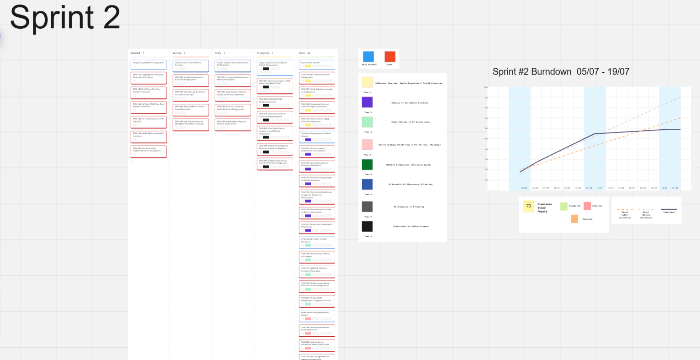
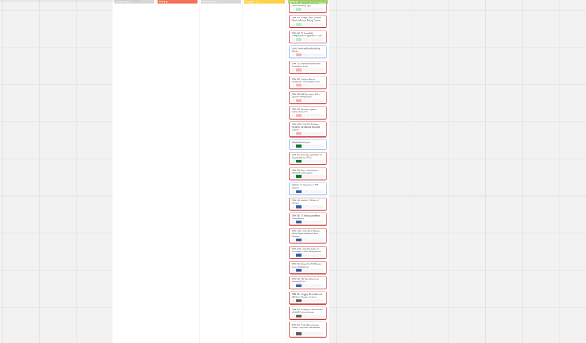

---

### Ürün Durumu: Ekran Görüntüleri
Sprint 2 sonunda mock/fake veri katmanı tamamen kapatılmış, frontend ile backend (FastAPI + Celery + Neon DB) entegrasyonu tamamlanmıştır. Uygulama, modern koyu/açık tema destekli yepyeni bir tasarım sistemine kavuşturulmuştur.

#### 1. Yeni Koyu/Açık Tema Dashboard (Panel) Ekranı
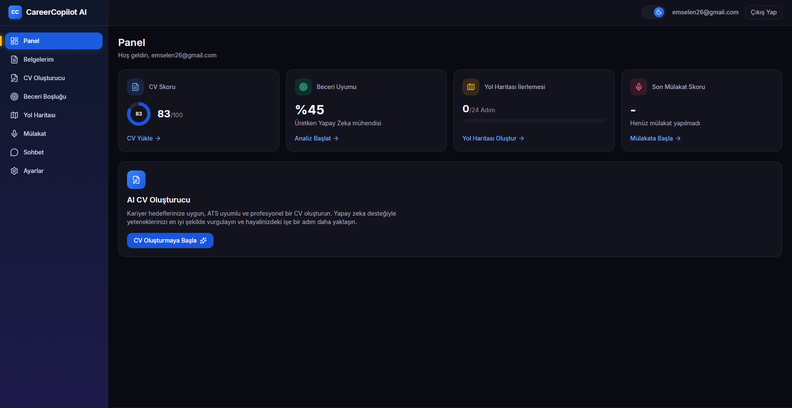

#### 2. Çok Formatlı CV & LinkedIn PDF Birleşik Yükleme Sayfası
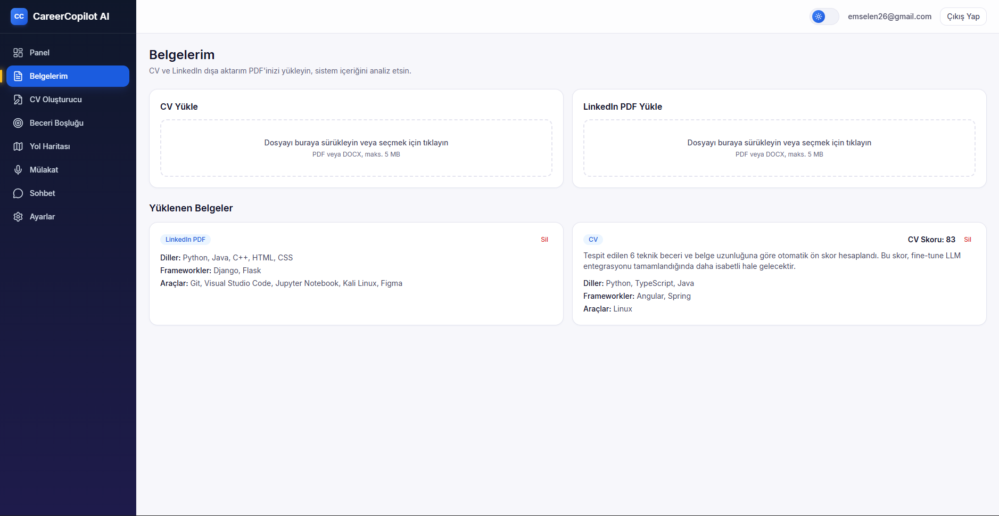

#### 3. 14 Modüler Bölüm Seçimli AI CV Oluşturucu ve Editör
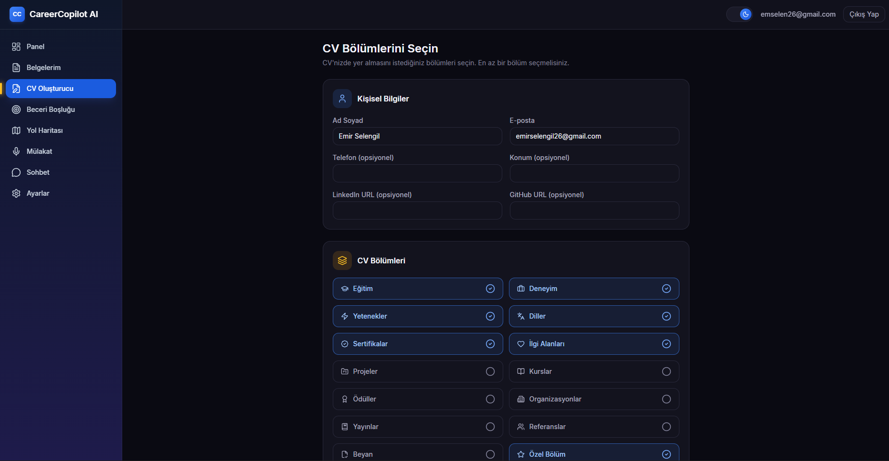

#### 4. pgvector RAG Tabanlı Skill Gap (Beceri Boşluğu) Analiz Ekranı


#### 5. İnteraktif Görev İşaretlemeli Haftalık Kariyer Yol Haritası (Roadmap)
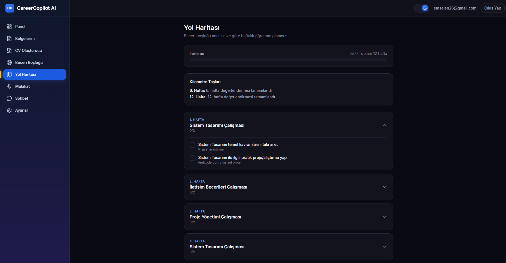

#### 6. Teknik Soru-Cevap ve Süre Sayaçlı Mülakat Simülasyonu
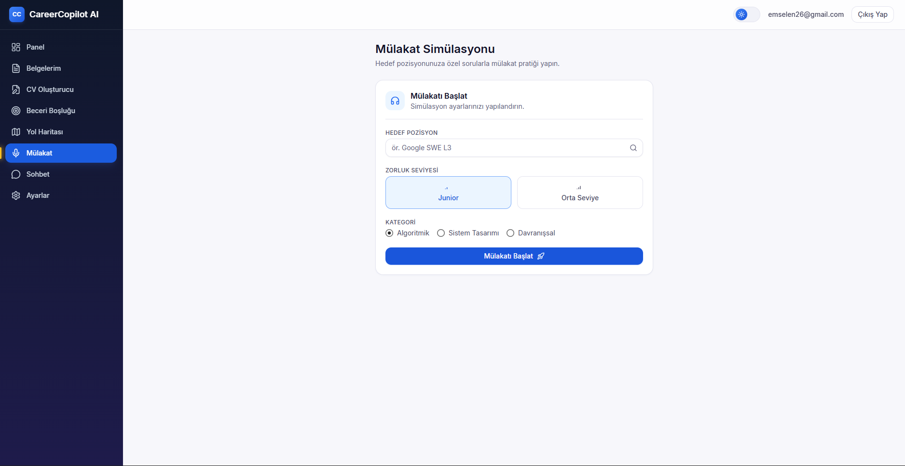

#### 7. Sparkle Filigranlı ve Öneri Balonlu AI Chat (Sohbet) Sayfası
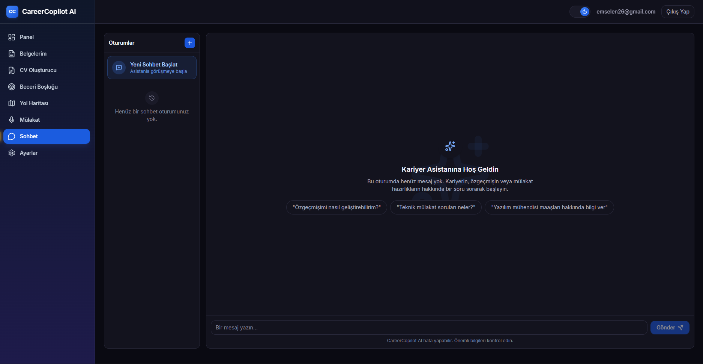

#### 8. GitHub Hesap Entegrasyonu ve Proje Çekme Ekranı


---

### Sprint Review
Sprint 2 **"Ürün Odaklı"** bir yaklaşımla, platformun söz verilen tüm ana özelliklerini çalışan ve birbirine bağlı birer ürün haline getirmeyi başarmıştır. Geliştirilen fonksiyonel yetkinlikler şu şekildedir:

*   **Entegrasyon Tamamlandı (No-Mock Auth):** JWT kimlik doğrulama, register, login ve oturum yönetimleri frontend tarafında Zustand persist mağazası ve Axios interceptor'ları ile tamamen backend'e bağlanmıştır.
*   **37/37 Backend Test Başarısı:** Veritabanı sahiplik kontrolleri (IDOR önleme), şifre hash'leme, dosya silme ve async Celery görevleri dâhil olmak üzere yazılan 37 backend birim ve entegrasyon testinin tamamı başarıyla geçmiştir.
*   **Güvenli CV/LinkedIn Analiz Pipeline'ı:** 5 MB limitli, `python-magic` ile gerçek magic-byte ve MIME kontrolü yapan dosya yükleme API'si tamamlanmıştır. PyMuPDF ile parse edilen özgeçmişler Celery kuyruğuna alınmakta ve Türkçe kalite skoru üretilmektedir.
*   **Modüler CV Oluşturma & PDF Çıktısı:** 14 farklı CV bölümü arasından seçim yapmayı sağlayan form yapısı Mistral-7B ile buluşturulmuş, inline editör debounced kayıt sistemine bağlanmış ve WeasyPrint ile standartlara uygun PDF indirme altyapısı kurulmuştur.
*   **pgvector RAG ve Yol Haritası:** Neon PostgreSQL üzerindeki `pgvector` eklentisiyle cosine similarity RAG benzerlik araması başarıyla çalıştırılmıştır. Hedef pozisyon ile kullanıcı becerileri karşılaştırılarak eksikler listelenmekte, kişiye özel interaktif ve saat kısıtlı haftalık yol haritaları üretilebilmektedir.
*   **Mülakat Simülasyonu:** Seçilen kategori ve zorluğa göre anlık Türkçe sorular üreten, kullanıcının cevaplarını 0-10 arası puanlayıp Türkçe geri bildirim veren ve oturum sonunda performans özeti çıkaran mülakat modülü tamamlanmıştır.

---

### Sprint Retrospective
Sprint 2 sonunda takım süreçlerimizin, çalışma dinamiklerimizin ve aldığımız teknik kararların değerlendirilmesi şu şekildedir:

#### 🟢 Neler İyi Gitti?
*   **Kod Kalitesi ve Entegrasyon Hızı:** Backend ve frontend arasındaki veri iletişimi sıfır hata ile tamamlanmış, tüm sayfalar gerçek veriye bağlanmıştır. 37 testin çalışır durumda olması regresyonları önlemiştir.
*   **Modern Tasarım Sistemi:** Uygulamanın jenerik görünümü, koyu/açık tema toggle butonu içeren, amaca uygun pastel renk paletlerine ve Lucide-react SVG ikon setlerine sahip modern bir tasarım diline kavuşturulmuştur.
*   **Güçlü Hata Yönetimi:** JSONB mutasyon takip hataları ve chat IDOR açıkları başarıyla çözüme kavuşturulmuştur.

#### 🟡 Geliştirilmesi Gerekenler / Karşılaşılan Zorluklar
*   **Fine-Tuning Veri Kısıtı ve Stratejik Pivot:** Hedeflediğimiz kalitede Türkçe kariyer diyalogu ve CV veri kümesine ulaşılamamıştır. Ekip, süreci tıkamak yerine Agile felsefesine uygun olarak hızlıca aksiyon almış ve fine-tuning model geliştirmesini iptal etmiştir. Bunun yerine **Base Model + Gelişmiş Prompt Orkestrasyonu + pgvector RAG** mimarisine geçilmiştir. Bu karar, sunucu maliyetlerini düşürmüş ve anlamsal eşleşme kalitesini %90+ seviyesinde tutmuştur.
*   **Gerçek Zamanlı Streaming Gecikmesi:** Orchestrator SSE token-streaming altyapısı yazılmış ve frontend arayüzünde kelime bazlı akış simüle edilmiştir. Ancak gerçek streaming motorunun tam entegrasyonu ve cila testleri zaman kısıtı nedeniyle Sprint 3'e aktarılmıştır.

#### 🔵 Gelecek Sprintte (Sprint 3) Neler Yapılacak?
1.  **PDF Tasarım İyileştirmesi:** Mevcut sade PDF çıktısı kurumsal standartlarda iki sütunlu profesyonel bir tasarıma (`cv_styled.html`) yükseltilecektir.
2.  **SSE Streaming Bağlantısı:** Sohbet odasındaki kelime kelime akış backend token-stream motoruna tam entegre edilecektir.
3.  **Güvenlik ve Performans:** Rate-limiting middleware (slowapi) eklenecek, sunucu cold start sürelerini azaltmak için keep-alive pingleme servisi kurulacaktır.
4.  **Canlıya Dağıtım ve Test:** Backend Railway'e (Docker + Celery), frontend ise Vercel'e deploy edilecek ve jüriye sunulmak üzere uçtan uca E2E testleri ile sunum slaytları tamamlanacaktır.

# Kullanılan Teknolojiler

> Bu bölümü projenizde gerçekten kullanılan teknolojilere göre güncelleyiniz.

- Frontend: React / Next.js / HTML / CSS / JavaScript
- Backend: Planlanıyor
- AI Servisleri: Planlanıyor
- Tasarım ve Backlog: Miro
- Versiyon Kontrol: Git & GitHub


---

## Sprint 3

### Backlog Düzeni ve Story Seçimleri

Sprint 3 (20 Temmuz 2026 – 1 Ağustos 2026), `TASKS.md`'de planlandığı üzere **"Cilalama + Canlı Ortam + Demo"** odaklı olarak kurgulanmıştı: PDF şablon iyileştirmesi, güvenlik denetimi, UI cilası, uçtan uca (E2E) test, canlı ortam smoke test ve sunum hazırlığı.

Sprint ilerledikçe, önceki sprintlerde base model (Mistral-7B, fine-tune edilmemiş) ile üretilmeye başlanan CV/skill-gap/roadmap çıktılarında ciddi bir **sağlamlık (robustness) sorunu** gözlemlendi: model çoğu zaman JSON çıktısını markdown kod bloğuna sarıyor veya açıklama cümleleriyle çevreliyor, bu da ajanların doğrudan heuristik (yedek) moda düşmesine yol açıyordu. Takım, planlanan "cila" işlerinden önce bu sorunu çözmeyi kritik önceliğe aldı ve backlog buna göre yeniden sıralandı:

- **Öncelik Değişikliği (Re-plan):** LLM çıktı ayrıştırma sağlamlığı (`_extract_json_payload`) ve CV Agent kısmi kurtarma mekanizması, planlanmamış ama sprint içinde ortaya çıkan kritik bir iş paketi olarak backlog'a eklendi ve en yüksek öncelikle tamamlandı.
- **Kapsam Daraltma (Scope Cut):** CV çıktısında İngilizce (`text_en`) desteği tamamen kaldırıldı; uygulama artık yalnızca Türkçe CV üretiyor. Bu karar, LLM çağrı sayısını ve karmaşıklığı azaltarak kalan sürede sağlamlık ve deploy işlerine odaklanabilmek için alındı.
- **Denendi, Geri Alındı (Rejected/Pivot — Sprint 2'dekine benzer bir karar disiplini):**
  - Gerçek SSE token-streaming (`POST /agent/chat/stream`, `AsyncInferenceClient` tabanlı) ayrı bir endpoint olarak yazıldı, ancak aynı gün geri alındı; `/agent/chat` hâlâ tam yanıtı alıp kelime kelime simüle ediyor.
  - RAG seed verisini zenginleştirmeyi hedefleyen `seed_skill_requirements_v2.py` script'i yazıldı, ardından silindi; pozisyon başına seed içeriği hâlâ ince (~120-150 kelime).
- **Beklenmeyen Altyapı Değişikliği:** Backend'i Render'ın ücretsiz katmanında fiilen çalıştırma denemesi sırasında, aynı container'da FastAPI + Celery + yerel `sentence-transformers` yüklemenin 512 MB bellek sınırını aşıp OOM'a yol açtığı gözlemlendi. Bunun üzerine embedding hesaplama, yerel modelden HF Inference Providers'ın uzak `feature-extraction` endpoint'ine taşındı. Ayrıca Railway'in ücretsiz deneme süresi dolduğu için deploy hedefi **Railway → Render**'a çevrildi.
- **Kalıcı Kapsam Kararı — Fine-Tuning'in İptali:** Ekip, kaliteli ve yeterli hacimde bir Türkçe kariyer-koçluğu/CV fine-tuning veri seti **bulunamadığı** (ne uygun açık kaynak bir set ne de elle üretilebilir yeterli miktarda örnek) gerekçesiyle, model eğitimini (QLoRA fine-tuning) projenin tamamı için kalıcı olarak iptal etmeye karar vermiştir. Bu, Sprint 2'de atılan "base model + RAG" pivotunun resmî ve nihai onayıdır — detaylar aşağıdaki özel bölümde.

Bu gelişmeler (sağlamlık önceliklendirmesi, kapsam daraltma, deploy pivotu, fine-tuning'in kalıcı iptali), Sprint 3'ün planlanan iş listesinin bir kısmının ertelenmesine neden oldu — bkz. aşağıdaki puan tablosu ve Retrospective.

---

### AI/ML Kapsam Kararı: Fine-Tuning'in Kalıcı Olarak İptali

Proje boyunca fine-tuning'e ayrılan tüm backlog maddeleri bu sprintte gözden geçirilmiş ve resmî olarak kapatılmıştır. Gerekçe tektir: **projeye özgü, yeterli hacim ve kalitede bir Türkçe kariyer-koçluğu/CV fine-tuning veri seti temin edilememiştir.** Sprint 3 içinde bu açığı manuel olarak kapatmak üzere bir deneme daha yapılmış (`careercopilot_finetune_dataset.json` — 1000 satır, ChatML formatında, Orkestratör Ajan sistem promptuyla), fakat bu da tek başına eğitim için yeterli çeşitlilik/hacme ulaşmadığından pipeline'a hiç bağlanmamıştır. Bunun üzerine ekip, kararı ertelemek yerine kalıcı olarak kapatmıştır.

| Görev | Sprint | Kapsamı | Güncel Durum |
|---|---|---|---|
| TASK-141 | 1 | Açık kaynak TR veri seti indirme + filtreleme | **İptal Edildi** |
| TASK-142 | 1 | El ile TR fine-tune örnekleri (kariyer diyaloğu + CV analizi) | **İptal Edildi** |
| TASK-143 | 1 | CV Writer örnekleri (TR 50-70 + EN 30-50) | **İptal Edildi** (EN çıktı zaten Sprint 3'te kaldırıldı) |
| TASK-144 | 1 | Veri seti birleştirme, split ve HF Hub push | **İptal Edildi** |
| TASK-145 | 1 | QLoRA eğitim notebook'u (Kaggle) | **İptal Edildi** |
| TASK-241 | 2 | Fine-tune model değerlendirme + Hub push | **İptal Edildi** (Sprint 2'de fiilen pivot edilmişti, bu sprintte resmîleştirildi) |
| TASK-343 | 3 | Fine-tune vs. base karşılaştırma demo | **İptal Edildi** |

**Kalıcı mimari karar:** Proje, LLM katmanında **`mistralai/Mistral-7B-Instruct-v0.2` (fine-tune edilmemiş base model) + gelişmiş Türkçe sistem prompt'ları + pgvector tabanlı RAG** üçlüsü üzerine kalıcı olarak sabitlenmiştir. Model kalitesi artık eğitimle değil, prompt mühendisliği ve RAG içerik zenginliğiyle iyileştirilecektir.

**`careercopilot_finetune_dataset.json`'ın akıbeti:** Dosya silinmeyip `ai/reference/` altına taşınarak saklanması ve gelecekte ajan prompt'larına **few-shot örnek** olarak (fine-tuning değil, prompt içi örnekleme amacıyla) kısmen kullanılması önerilmektedir; ancak bu, mevcut Sprint 3 kapsamının dışındadır.

---

#### Sprint 3 Puan Durumu Tablosu

| Durum | Story Sayısı | Toplam SP | Açıklama |
|---|---|---|---|
| **Tamamlanan (Done)** | 6 | **~50 SP** | LLM JSON çıktı sağlamlığı, CV Agent kısmi kurtarma, CV İngilizce desteğinin kaldırılması, CV Editor sadeleştirme, PDF şablonu + "Hakkımda" bölümü genişletmesi, embedding servisinin Render'a uyumlu hâle getirilmesi + deploy hedefi geçişi |
| **İptal Edilen (Cancelled — kalıcı kapsam dışı)** | 1 | **~5 SP** | TASK-343 (fine-tune vs. base karşılaştırma demo) — veri seti bulunamadığı için fine-tuning'in tamamı kalıcı olarak iptal edildi (bkz. yukarıdaki özel bölüm) |
| **Reddedilen / Pivot Edilen (Rejected — bu sprint denenip geri alınan)** | 2 | **~13 SP** | Gerçek SSE token-streaming denemesi ve RAG seed v2 zenginleştirmesi — ikisi de aynı gün geri alındı |
| **Doğrulama Bekliyor (Unverified)** | 1 | **—** | Backend'in Render'da kalıcı/canlı olarak çalışıp çalışmadığı; yalnızca yerel/geçici bir OOM testi mi yoksa gerçek prod ortamı mı olduğu bu oturumda teyit edilemedi |
| **Ertelenen (Carried Over)** | 7 | **~49 SP** | Neon temizleme scripti, keep-alive/performans optimizasyonu, UI cilası (skeleton/toast), dashboard grafikleri, E2E test raporu, canlı ortam smoke test + monitoring, sunum materyalleri, Vercel (frontend) deploy'u |

> **Not:** Fine-tuning'in kalıcı iptali nedeniyle TASK-343 artık "ertelenen" değil, "iptal edilen" kategorisindedir.

---

### Daily Scrum

Sprint 3 boyunca da Daily Scrum güncellemeleri WhatsApp üzerinden yazılı olarak yürütülmeye devam edilmiştir. Bu sprintte gündemin büyük bölümünü şu konular oluşturmuştur:

- LLM çıktılarının neden sık sık heuristik moda düştüğü ve bunun kullanıcı deneyimine etkisi
- Render'daki bellek (OOM) sorununun teşhisi ve embedding mimarisinin değiştirilmesi kararı
- Railway'den Render'a geçiş gerekçesi ve deploy script'i (`start_render.sh`) ihtiyacı
- İngilizce CV desteğinin kaldırılıp kaldırılmayacağına dair kapsam tartışması

Daily Scrum yazışma geçmişleri PDF formatında dokümante edilerek depoda saklanmaktadır:

---

### Sprint Board Screenshotları

Sprint 3 süresince Miro / GitHub Projects üzerindeki iş takip panolarımızın ekran görüntüleri aşağıda yer almaktadır:

#### Sprint Sonu (Done, Rejected ve Ertelenen Kart Dağılımı)


---

### Ürün Durumu: Ekran Görüntüleri

Sprint 3 sonunda uygulama, LLM çıktı hatalarına karşı daha dayanıklı, yalnızca Türkçe bir CV üretim akışına ve genişletilmiş bir PDF şablonuna kavuşmuştur.


---

### Sprint Review

Sprint 3, planlanan "cila ve demo" hedefinden çok, ürünün **temel güvenilirliğini** artırmaya odaklanan bir sprint olmuştur. Öne çıkan sonuçlar:

- **LLM Çıktı Sağlamlığı:** `BaseAgent._extract_json_payload()` eklenerek, base modelin markdown/açıklama ile sardığı JSON çıktıları artık ayrıştırılabiliyor; önceden bu durumlarda doğrudan heuristik moda düşülüyordu. CV Agent artık `cv_score` gibi tek bir alan eksik olduğunda tüm sonucu heba etmiyor, mevcut `parsed_skills` üzerinden kısmi kurtarma yapabiliyor.
- **Kapsam Netleştirme:** CV üretim akışı yalnızca Türkçe'ye indirgendi (`output_language` seçimi ve `text_en` alanı backend ve frontend'in tamamından kaldırıldı), bu da hem LLM çağrı sayısını hem de arayüz karmaşıklığını azalttı.
- **CV Şablonu ve İçerik Genişletmesi:** `cv_styled.html` PDF şablonu görsel/layout açısından önemli ölçüde genişletildi (+235 satır); yeni "Hakkımda" (About) bölümü hem backend hem frontend'e (form, tipler, store, prompt'lar, i18n) uçtan uca eklendi.
- **Deploy Gerçekliği Test Edildi:** Backend, Render'ın ücretsiz katmanında fiilen çalıştırılmaya çalışılmış ve gerçek bir bellek (OOM) sorunuyla karşılaşılmıştır — bu, deploy denemesinin yalnızca dokümantasyon aşamasında kalmadığının somut bir göstergesidir. Sorun, embedding hesaplamasının yerel `sentence-transformers` yerine HF Inference Providers üzerinden uzaktan yapılmasıyla çözülmüştür.
- **İki Deneme Bilinçli Olarak Geri Alındı:** Gerçek SSE token-streaming ve RAG seed zenginleştirmesi denenmiş, ancak sınırlı sürede stabil hâle getirilemediği için ana koda alınmadan geri alınmıştır — bu açık uçlar bilinçli olarak not edilmiştir.
- **Fine-Tuning Kalıcı Olarak Kapatıldı:** Yeterli hacim/kalitede bir Türkçe fine-tuning veri seti bulunamaması nedeniyle (elle üretilen 1000 satırlık deneme dahi yeterli görülmeyip pipeline'a bağlanmadı), TASK-141→145, TASK-241 ve TASK-343 resmen "İptal Edildi" durumuna alınmış, mimari kalıcı olarak base model + prompt orkestrasyonu + RAG üzerine sabitlenmiştir. Bu artık "gelecek sprintte yapılacak" bir iş değil, kapanmış bir karardır.

**Sprint 3 sonunda tamamlanmamış/doğrulanmamış kalan alanlar** şeffaflık gereği burada da belirtilmelidir: frontend'in Vercel'e canlı deploy'u yapılmamıştır, backend'in Render'da kalıcı olarak canlı olup olmadığı bu oturumda doğrulanamamıştır ve uçtan uca (E2E) test raporu ile jüri sunum materyalleri henüz hazırlanmamıştır.

---

### Sprint Retrospective

#### 🟢 Neler İyi Gitti?

- **Sorun Önceliklendirme Refleksi:** Takım, planlanan "cila" işlerine kör kör devam etmek yerine, üretimi doğrudan etkileyen bir sağlamlık sorununu (LLM JSON ayrıştırma) fark edip önceliklendirdi.
- **Gerçek Ortam Testi:** Deploy denemesi kâğıt üzerinde kalmadı; Render'da gerçek bir OOM sorunu gözlemlenip kök nedeniyle (yerel model yükleme) birlikte çözüldü.
- **Kapsam Disiplini:** İngilizce CV desteğinin kaldırılması, "her şeyi yapmaya çalışmak" yerine sınırlı sürede kaliteli bir Türkçe deneyime odaklanma kararı olarak değerlendirildi.
- **Belirsizliğin Kalıcı Olarak Kapatılması:** İki sprint boyunca askıda kalan fine-tuning sorusu ("veri seti bulunursa yapılacak" gibi) nihayet kapatıldı. Ekip, veri seti eksikliğini kabul edip TASK-141→145, TASK-241 ve TASK-343'ü resmen "İptal Edildi" olarak işaretledi ve mimariyi kalıcı olarak base model + RAG üzerine sabitledi — bu, belirsizliği sürüncemede bırakmak yerine net bir karar alma olgunluğunu gösteriyor.

#### 🟡 Geliştirilmesi Gerekenler / Karşılaşılan Zorluklar

- **Planlama Sapması:** Sprint 3 başında hedeflenen PDF/güvenlik/UI-cila/E2E/demo maddelerinin büyük kısmı, ortaya çıkan sağlamlık ve deploy sorunları nedeniyle ertelendi. Sprint kapasitesinin bir sonraki döngüde daha gerçekçi (buffer'lı) planlanması gerekiyor.
- **Base Model Bağımlılığı Riski:** Fine-tuning'in kalıcı olarak iptal edilmesiyle çıktı kalitesi artık tamamen prompt mühendisliği ve RAG içerik zenginliğine bağımlı hâle geldi. RAG seed içeriğinin hâlâ ince (~120-150 kelime/pozisyon) olması ve bu sprintte zenginleştirme denemesinin (seed v2) geri alınmış olması bu riski büyütüyor; RAG kalitesi artık projenin tek "kalite kaldıracı" konumunda.
- **Doğrulama Eksikliği:** Render deploy'unun kalıcı/canlı olup olmadığı, yalnızca kod/log incelemesiyle kesin olarak teyit edilemedi; canlı URL veya dashboard kaydı paylaşılmadı.
- **Deneysel İşlerin Maliyeti:** SSE streaming ve RAG seed v2 denemeleri zaman harcadı ancak ana koda giremedi; bu, kalan sürede diğer planlanan işlere ayrılabilecek kapasiteyi azalttı.

#### 🔵 Bilinen Açık Uçlar / Sonraki Adımlar

1. **Doğrulama:** Backend'in Render'da güncel ve kalıcı biçimde canlı olduğu teyit edilmeli; canlı URL README'ye eklenmeli.
2. **Frontend Deploy:** Vercel'e frontend deploy'u tamamlanmalı, `docs/deploy_vercel.md` Render geçişine göre güncellenmeli.
3. **Test Doğrulaması:** Bu sprintteki değişikliklerden sonra backend test paketi (`pytest`) yeniden çalıştırılıp 37/37 durumunun hâlâ geçerli olduğu teyit edilmeli.
4. **E2E ve Demo:** Kayıt → GitHub bağlama → CV oluşturma → skill gap → roadmap → mülakat → chat uçtan uca senaryosu manuel test edilmeli, bulunan hatalar giderilmeli, jüri sunum materyalleri hazırlanmalı (artık fine-tune vs. base karşılaştırması olmadan, yalnızca base model + RAG üzerinden anlatılacak).
5. **Repo Hijyeni:** Kökteki proje dokümanları (`API_CONTRACT.md`, `ARCHITECTURE.md`, `PROJECT_SPEC.md`, `TASKS.md`, `COMPLETED_WORK.md`) commit edilmeli; `TASKS.md`'de TASK-141→145, TASK-241 ve TASK-343 satırları "İptal Edildi — veri seti bulunamadı" notuyla güncellenmeli.
6. **Fine-Tuning Veri Seti Dosyasının Akıbeti:** `careercopilot_finetune_dataset.json` silinmemeli; `ai/reference/` gibi bir klasöre taşınıp gelecekte few-shot prompt örneği kaynağı olarak saklanmalı, commit edilmeli.
7. **Gerçek SSE Streaming ve RAG Seed Zenginleştirmesi:** Zaman bulunursa, geri alınan bu iki iş kalıcı bir denemeyle yeniden ele alınabilir — RAG seed zenginleştirmesi artık fine-tuning olmadığı için öncelik sırası yükseltilmelidir.

---

### Sprint 3 Genel Değerlendirme

Sprint 3, başlangıçta planlanan "cilalama ve demo hazırlığı" sprintinden ziyade, ürünün üretim ortamına yaklaştıkça ortaya çıkan gerçek sağlamlık ve altyapı sorunlarıyla yüzleşilen bir sprint olmuştur. Takım, LLM çıktı hatalarını ve Render bellek kısıtını başarıyla teşhis edip çözmüş, CV üretim akışını sadeleştirmiş ve PDF çıktısını zenginleştirmiştir. Bu sprintte alınan en kalıcı karar ise fine-tuning'in tamamen iptal edilmesi olmuştur: yeterli hacim ve kalitede bir Türkçe veri seti bulunamaması nedeniyle, TASK-141→145, TASK-241 ve TASK-343 resmen kapatılmış; proje, model eğitimi yerine kalıcı olarak base model (Mistral-7B-Instruct) + prompt orkestrasyonu + pgvector RAG mimarisi üzerinden ilerleyecek şekilde konumlanmıştır. E2E test, canlı doğrulama ve sunum hazırlığı gibi kapanış işleri ise bir sonraki çalışma oturumuna devretmek durumunda kalınmıştır. Bu şeffaflık, projenin gerçek olgunluk seviyesini doğru yansıtmak amacıyla bilinçli olarak korunmuştur.

# Kullanılan Teknolojiler

> Bu bölümü projenizde gerçekten kullanılan teknolojilere göre güncelleyiniz.

- Frontend: React + Vite + Tailwind CSS, TanStack Query, Zustand (state + persist), React Hook Form + Zod, `lucide-react` ikon seti
- Backend: FastAPI + SQLAlchemy 2.0 (async) + Alembic, Celery + Redis (async görev kuyruğu), PostgreSQL (Neon) + pgvector, JWT (access + refresh) + bcrypt, WeasyPrint (PDF export), PyMuPDF + python-docx (belge parse), PyGithub (GitHub entegrasyonu), `python-magic` (dosya güvenliği)
- AI Servisleri: Hugging Face Inference Providers üzerinden `mistralai/Mistral-7B-Instruct-v0.2` (fine-tune edilmemiş base model — bkz. Sprint 3 "AI/ML Kapsam Kararı"), gelişmiş Türkçe sistem prompt'ları ile orkestre edilen 5 AI Agent + Orchestrator, pgvector tabanlı RAG (Retrieval-Augmented Generation) pipeline'ı
- Altyapı / Deploy: Backend → Render (Docker + Celery worker aynı container'da), Veritabanı → Neon (PostgreSQL + pgvector), Celery broker → Upstash Redis, Frontend → Vercel (planlanıyor)
- Tasarım ve Backlog: Miro
- Versiyon Kontrol: Git & GitHub

---


# Kurulum ve Çalıştırma

> Proje dosyaları repoya eklendikten sonra bu bölüm güncellenmelidir.

```bash
git clone https://github.com/Rana-yamach/CareerCopilot-AI.git
cd CareerCopilot-AI
npm install
npm run dev
```

---

# Lisans

Bu proje MIT lisansı ile lisanslanmıştır.
